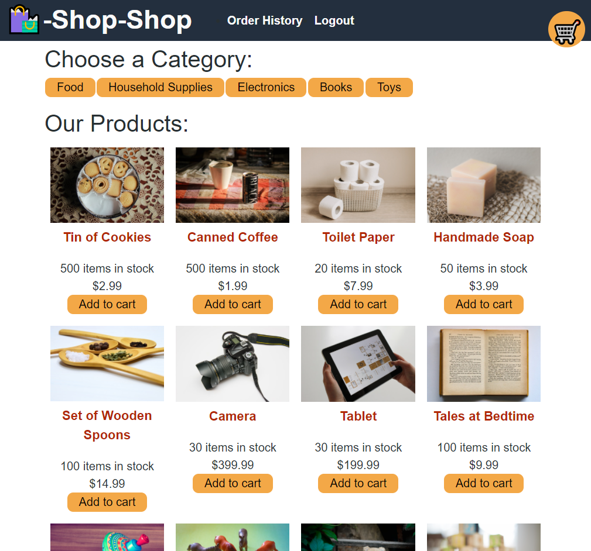

# Redux Shop

## Description
A redux refactored e-commerce page that allows for users to login and purchase items, putting them into a cart.

Table of Contents |
-------------------|
[Installation](#Installation)
[Usage](#Usage)
[Screenshots](#Screenshots)
[Contributing](#Contributing)
[Questions](#Questions)

 

## Installation

In order to run the project locally for development and testing, ensure that dependencies are installed by running:

`npm install`

 

## Usage

The application is an e-commerce platform designed initially with Context API before being refactored to work with Redux store. The application is a SPA site and the initial state is defined with the reducers folder. The aim of the project was to familiarize with the Redux documentation and apply it to the e-commerce application.

You can find the deployed link and the repository link below:

Deployed Link: [Deployed Link](https://thawing-badlands-46377.herokuapp.com/)

Repo Link: [Repo Link](https://github.com/cerafinn/redux-shop)

 

## Screenshots

## Contributing

If interested in contributing to the project, feel free to reach out. Contact information can be found in the [Questions](#Questions) section.

 

## Questions

If you have any questions or issues, feel free to reach out through andaleeb.farooq@gmail.com.
You can also find more of my work on Github at [github link](https://github.com/cerafinn)